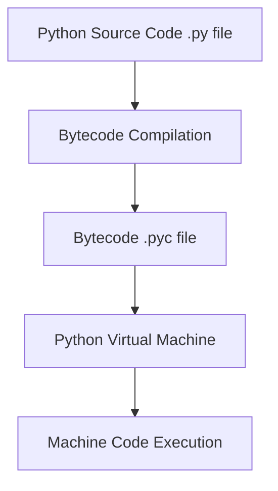

About Me 👋

Hey there! I'm a backend developer who loves building solid, scalable systems.
I mostly work with Python and C#, and I’ve been doing this professionally for a few years now.
These days, I’m focused on cyber threat intelligence—building secure and efficient backend 
solutions with things like API integrations, web scraping, and database management.    

This site is where I jot down technical notes, mini-guides, and experiments as I go. 
It’s my way of cementing what I learn and hopefully helping others along the way.
Feel free to check out my projects or reach out if you’d like to connect! 🚀

## Articles

[Systemy Operacyjne - notatki](https://github.com/michal-siedlecki/michal-siedlecki.github.io/blob/main/Systemy%20Operacyjne%20-%20notatki.md)

[Computer networks](https://github.com/michal-siedlecki/michal-siedlecki.github.io/blob/main/Computer%20networks.md)

---
## Python quirks and features

### What is PEP8?
PEP 8 stands for Python Enhancement Proposal 8. It is the official style guide for
writing Python code, and it's widely followed by Python developers to ensure clean, 
readable, and consistent code. PEP 8 covers various aspects of code style, 
including **indentation, naming conventions, whitespace usage, and line length**.
For example, it recommends keeping lines shorter than 79 characters to enhance readability.
As the Python language evolves, PEP 8 is occasionally updated to reflect new best practices
and coding standards.
There are python libraries which can check your code against specific guidelines. For more 
information please check `flake8`, `blue` or `black`

### Is python compiled or interpreted language?
Python is generally considered an interpreted language, although there is a 
compilation step involved. When a Python script is run, the Python interpreter first compiles 
the source code (.py file) into bytecode — an intermediate, platform-independent format.
This bytecode is often saved as a .pyc file and is then executed by the Python Virtual Machine 
(PVM), which interprets it line by line. The PVM translates the bytecode into machine-level 
instructions that the operating system and processor can understand.
So while Python isn't compiled to machine code ahead of time like C or C++, it does go through 
a compilation step before execution — which is why it’s called an interpreted language with 
compiled bytecode.

### What data type can be used as a key in dictionary
In Python, dictionary keys must be hashable objects, which means they must have a fixed 
hash value during their lifetime and implement the __hash__() and __eq__() methods properly.
Common hashable types include integers, strings, and tuples (as long as all elements inside 
are also immutable and hashable). These types are immutable, which ensures that their hash 
values remain consistent.
If you want to use a custom object as a dictionary key, you'll need to implement the
__hash__() and __eq__() methods in your class to define how it should be hashed and compared.
Python dictionaries are similar to hash tables in other languages, allowing for fast 
key-based access to values.

### What would happen when you call asyncio method without awaiting it?
Calling an async method without await does not run it. It returns a coroutine object that must be awaited or scheduled.
If you don’t do anything with it, it won’t execute, and you might get a warning.
```python
import asyncio

async def my_coroutine():
    print("Running coroutine")

coro = my_coroutine()  # This doesn't run the coroutine!
print(type(coro))      # <class 'coroutine'>
```

### Metaclasses
Metaprogramming refers to a contept that the program manipulates itself during execution. Metaclassess allow to create new type, but let's try to do it manually first:
```
def bar():
	print('test')

type('Foo', (), dict(bb=bar))
```

The metaclasses allow customization of class instantiation:
```
>>> class Meta(type):
...     def __init__(
...         cls, name, bases, dct
...     ):
...         cls.attr = 100
...
>>> class X(metaclass=Meta):
...     pass
...
>>> X.attr
100

>>> class Y(metaclass=Meta):
...     pass
...
>>> Y.attr
100

>>> class Z(metaclass=Meta):
...     pass
...
>>> Z.attr
100
```

You can achieve the same simple example using base class or class decorator. 


### GIL, why it exists
The Global Interpreter Lock (GIL) is a mutex that protects access to Python objects, 
preventing multiple native threads from executing Python bytecodes at once. 

It exists primarily to simplify memory management in CPython, particularly the implementation 
of reference counting for garbage collection. While the GIL makes single-threaded code easier
to implement and debug, it becomes a bottleneck for CPU-bound multithreaded programs written 
in pure Python, as only one thread can execute Python bytecode at a time.

### Magic methods
By implementing magic methods in python objects we can add some behaviour executed with a normal Python syntax not necessary calling the attribute explicitly. There are many types of magic methods for example:
- construction:
`__new__, __init__, __del__` at creation and destruction of any object we may use these methods overrides
 - comparison:
`__eq__, __ne__, __lt__, __lg__, __le__, __ge__, __cmp__`
equal, not equal, less than, greater, less equal, greater equal, compare
- numeric operations `__abs__`, 
- arithmetic operations `__add__`, 
- type conversion `__float__`, 
- representing `__str__, __repr__`, 
- custom sequences behaviour `__len__`, `__iter__`, 
- reflection `__instancecheck__`, 
- context managers `__enter__`, `__exit__`


